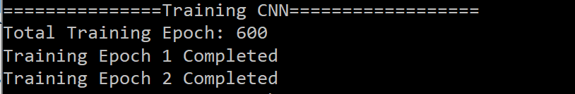

# 卷积神经网络(CNN)识别MNIST数据集

<!-- PROJECT SHIELDS -->
<!--
*** I'm using markdown "reference style" links for readability.
*** Reference links are enclosed in brackets [ ] instead of parentheses ( ).
*** See the bottom of this document for the declaration of the reference variables
*** for contributors-url, forks-url, etc. This is an optional, concise syntax you may use.
*** https://www.markdownguide.org/basic-syntax/#reference-style-links
-->
[![Contributors][contributors-shield]][contributors-url]
[![Forks][forks-shield]][forks-url]
[![Stargazers][stars-shield]][stars-url]
[![Issues][issues-shield]][issues-url]
[![MIT License][license-shield]][license-url]
[![LinkedIn][linkedin-shield]][linkedin-url]


<!-- PROJECT LOGO -->
<br />
<p align="center">
  <a href="https://github.com/ygrayson/cnn_mnist">
    
  </a>

  <h3 align="center">卷积神经网络CNN识别手写数字MNIST数据集</h3>
  <p align="center">
    机器学习界的果蝇实验，欢迎参考
  </p>
</p>


<!-- TABLE OF CONTENTS -->
## 目录

* [简介](#简介)
  * [使用工具](#使用工具)
* [安装](#安装)
  * [语言](#语言)
  * [平台](#平台)
* [开始识别数字！](#开始识别数字吧！)
  * [载入数据](#载入数据)
  * [看看数据啥样儿](#看看数据啥样儿)
  * [建立模型](#建立模型)
  * [训练模型](#训练模型)
  * [测试模型](#测试模型)
* [联系我](#联系我)
* [致谢](#致谢)


<!-- ABOUT THE PROJECT -->
## 简介

深度学习发展迅速，MNIST手写数字数据集作为机器学习早期的数据集已经被公认为是机器学习界的果蝇实验（Hinton某年)，卷积神经网络是识别图像非常有效的一种架构，于是用<b><u>CNN识别手写数字</b></u>也就成为了机器学习界的经典实验。在这个repo中我会呈现最基本的CNN识别MNIST数据集过程。
主要步骤如下：
* [载入数据](#载入数据)
* [看看数据啥样儿（也即Visualization）](#看看数据啥样儿)
* [建立模型](#建立模型)
* [训练模型](#测试模型)
* [测试模型（看看训练的好不好）](#测试模型)


### 使用工具
主要使用的语言和平台如下：
* 语言 - [Python](https://www.python.org/)
* 平台 - [Pytorch](https://pytorch.org/)


<!-- GETTING STARTED -->
## 安装

安装包括Python语言和几个必备的Pytorch包，使用Linux系统的安装方式如下:

### 语言
检查一下Python语言：
* Python
```sh
$ python3 --version
Python 3.7.7
```

### Pytorch包
1. 安装Pytorch
```sh
pip install torch
```
2. 安装Torchvision
```sh
pip install torchvision
```

3. 安装Matplotlib
```sh
pip install matplotlib
```


<!-- Start Recognizing Digits -->
## 开始识别数字吧！

完成了安装，我们就可以开始训练神经网络识别数字了，第一步载入数据。


### 载入数据

首先载入数据，全部MNIST手写数字数据集来自于[Yann LeCun网站](http://yann.lecun.com/exdb/mnist/)，这里我们使用torchvision.datasets里已经有的MNIST数据集，与从网站下载效果相同：
```python
from torchvision.datasets import MNIST
train_data = MNIST(root='./data', train=True, download=True, transform=transform)
test_data = MNIST(root='./data', train=False, download=True, transform=transform)
```

### 看看数据啥样儿

要想建立一个好的模型，首先我们要熟悉所处理的数据集是怎样的，MNIST的数据集中每一张手写数字图片均是灰度的28*28的图片，同上配有一个正确的0-9的label。先来一起看看训练集和测试集：
```python
print(train_data)
```
```
Dataset MNIST
    Number of datapoints: 60000
    Root location: ./data
    Split: Train
    StandardTransform
Transform: Compose(
               ToTensor()
               Normalize(mean=(0.5,), std=(0.5,))
           )
```
```python
print(test_data)
```
```
Dataset MNIST
    Number of datapoints: 10000
    Root location: ./data
    Split: Test
    StandardTransform
Transform: Compose(
               ToTensor()
               Normalize(mean=(0.5,), std=(0.5,))
           )
```

训练集中有60000个手写数字及其label，测试集有10000个，接下来我们看看手写数字长啥样儿：

```python
# 展示前40张手写数字
import matplotlib.pyplot as plt

num_of_images = 40
for index in range(1, num_of_images + 1):
    plt.subplot(4, 10, index)
    plt.axis('off')
    plt.imshow(train_data.data[index], cmap='gray_r')
plt.show()
```
这段code用matplotlib画出前40张训练集里的手写数字，在同一张图里呈现，图如下：
<br/>

<br/>
我们的任务就是通过只看到手写数字的图片，建立一个CNN模型成功的识别出它是0-9的哪一个数字。


### 建立模型

我们选择的模型不算复杂，首先两层卷积提取图片的features，接下来两层完全连接进行识别（注意最后一层的output是10个，对应数字0-9）：
```python
# 卷积网络层
self.conv1 = nn.Conv2d(in_channels=1, out_channels=5, kernel_size=3, stride=1, padding=1)
self.maxpool1 = nn.MaxPool2d(kernel_size=2, stride=2)
self.conv2 = nn.Conv2d(in_channels=5, out_channels=10, kernel_size=3, stride=1, padding=1)
self.maxpool2 = nn.MaxPool2d(kernel_size=2, stride=2)

# 完全连接网络层
self.fc1 = nn.Linear(in_features=7*7*10, out_features=128)
self.fc2 = nn.Linear(in_features=128, out_features=10)
```

有个卷积神经网络的结构就可以定义forward函数了：
```python
def forward(self, x):
    """forward."""
    # 第一层卷积和取最大值
    x = F.relu(self.conv1(x))
    x = self.maxpool1(x)

    # 第二层卷积和取最大值
    x = F.relu(self.conv2(x))
    x = self.maxpool2(x)

    # 完全连接层
    x = x.view(-1, 7*7*10)
    x = F.relu(self.fc1(x))
    x = F.relu(self.fc2(x))

    return x
```

这样就完成了CNN模型的建立。


### 训练模型

先来看一下我们的模型有多少参数需要训练（剧透：很多）

```python
total_params = sum(p.numel() for p in model.parameters())
print(total_params)
```
```
64648
```

6万多的参数等待训练......首先定义Loss Function和optimizer，这里使用CrossEntropy和Adam:
```python
# 定义神经网络和训练参数
model = CNN()
criterion = nn.CrossEntropyLoss()
optimizer = optim.Adam(model.parameters(), lr=3e-4, weight_decay=0.001)
batch_size = 100
epoch_num = int(train_data.data.shape[0]) // batch_size
```

这里的batch_size是100，也就意味着我们一共有60000个数据在训练集里，要训练600个回合才能全部训练完。训练过程：
```python
for epoch in range(1, epoch_num+1):
    # 每个batch一起训练，更新神经网络weights
    for idx, (img, label) in enumerate(train_loader):
        optimizer.zero_grad()
        output = model(img)
        loss = criterion(output, label)
        loss.backward()
        optimizer.step()
    print("Training Epoch {} Completed".format(epoch))
```

训练的时间比较长，建议使用Amazon Web Service或者其他计算能力比较强的机器。  
由于我的机器实在太弱了，我训练了两轮就掐掉了，也就意味着只用了200个训练集的数字，估计表现会比较差（此处留下悬疑）
<!--
<br/>

<br/>
-->


### 测试模型

完成了训练后我们的主要任务就已经完成了，接下来就要看看我们的CNN训练的究竟好不好，测试集的10000个手写数字对于我们的CNN模型而言是全新的数据，因此我们用测试集看看效果：
```python
total = 0
correct = 0
for i, (test_img, test_label) in enumerate(test_loader):
    # 正向通过神经网络得到预测结果
    outputs = model(test_img)
    predicted = torch.max(outputs.data, 1)[1]
    print("Correct label is", test_label)
    print("Prediction is", predicted)
    
    # 总数和正确数
    total += len(test_label)
    correct += (predicted == test_label).sum()

accuracy = correct / total
print('Testing Results:\n  Loss: {}  \nAccuracy: {} %'.format(loss.data, accuracy*100))
```

一起来看看测试结果：

<!--
<br/>

<br/>
-->
竟然高达77%……我才只用了200个训练集。

<!-- Contact Me -->
## 联系我

Qianbo Yin - [@LinkedIn][linkedin-url] (Currently looking for PhD position!)

Project Link: [https://github.com/ygrayson/cnn_mnist](https://github.com/ygrayson/cnn_mnist)


<!-- ACKNOWLEDGEMENTS -->
## 致谢
* [MNIST手写数字数据集](http://yann.lecun.com/exdb/mnist/)
* [Start Your CNN Journey with PyTorch in Python](https://towardsdatascience.com/start-your-cnn-journey-with-pytorch-in-python-6f8364a79801)
* [Pytorch: Real Step by Step implementation of CNN on MNIST](https://medium.com/swlh/pytorch-real-step-by-step-implementation-of-cnn-on-mnist-304b7140605a)
* [Best-README-Template](https://github.com/othneildrew/Best-README-Template)
* [感谢清华大学杨哲宇师兄给我留的暑期作业](https://www.cbicr.tsinghua.edu.cn/)


<!-- MARKDOWN LINKS & IMAGES -->
<!-- https://www.markdownguide.org/basic-syntax/#reference-style-links -->
[contributors-shield]: https://img.shields.io/github/contributors/ygrayson/cnn_mnist.svg?style=flat-square
[contributors-url]: https://github.com/ygrayson/cnn_mnist/graphs/contributors
[forks-shield]: https://img.shields.io/github/forks/ygrayson/cnn_mnist.svg?style=flat-square
[forks-url]: https://github.com/ygrayson/cnn_mnist/network/members
[stars-shield]: https://img.shields.io/github/stars/ygrayson/cnn_mnist.svg?style=flat-square
[stars-url]: https://github.com/ygrayson/cnn_mnist/stargazers
[issues-shield]: https://img.shields.io/github/issues/ygrayson/cnn_mnist.svg?style=flat-square
[issues-url]: https://github.com/ygrayson/cnn_mnist/issues
[license-shield]: https://img.shields.io/github/license/ygrayson/cnn_mnist.svg?style=flat-square
[license-url]: https://github.com/ygrayson/cnn_mnist/blob/master/LICENSE.txt
[linkedin-shield]: https://img.shields.io/badge/-LinkedIn-black.svg?style=flat-square&logo=linkedin&colorB=555
[linkedin-url]: https://www.linkedin.com/in/qianbo-yin-a91861114/
